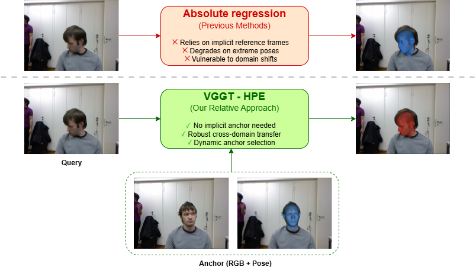
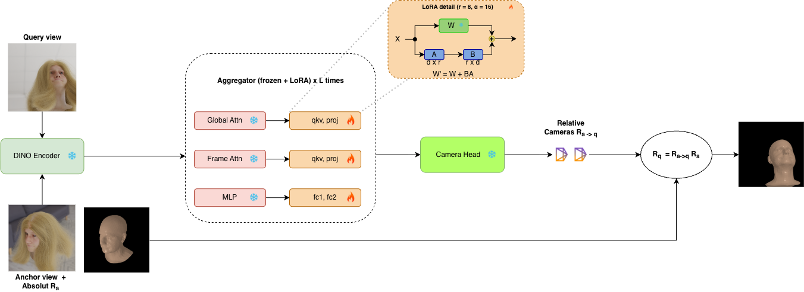
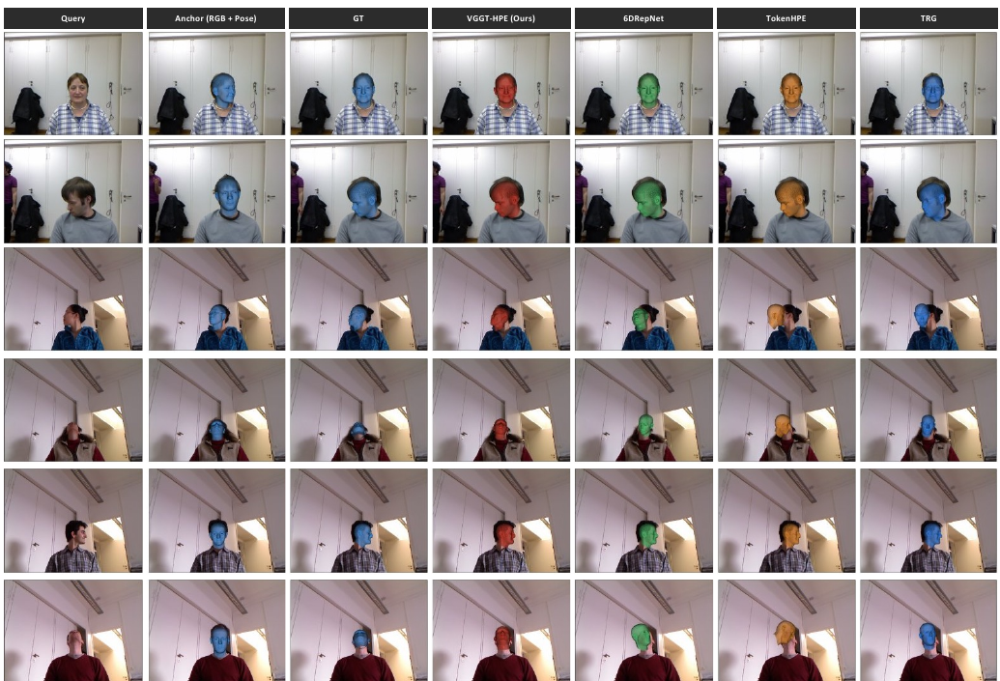

<div align="center">

# VGGT-HPE

### Reframing Head Pose Estimation as Relative Pose Prediction

<p>
  <a href="https://vasilikivas.github.io/">Vasiliki Vasileiou</a> ·
  <a href="https://filby89.github.io/">Panagiotis P. Filntisis</a> ·
  <a href="https://robotics.ntua.gr/members/maragos/">Petros Maragos</a> ·
  <a href="https://www.cis.upenn.edu/~kostas/">Kostas Daniilidis</a>
</p>

<p>
  <a href="https://vasilikivas.github.io/VGGT-HPE/">
    
  </a>
  <a href="https://vasilikivas.github.io/assets/pdf/2026127020.pdf">
    
  </a>
  <a href="https://github.com/VasilikiVas/vggt-hpe">
    
  </a>
</p>

</div>

<p align="center">
  
</p>

## Overview

VGGT-HPE reframes monocular head pose estimation as **relative pose prediction** instead of direct absolute regression. Rather than forcing a model to internalize a dataset-specific canonical reference frame, we estimate the rigid transformation between a **query image** and an **anchor image with known pose**. Fine-tuned only on synthetic facial renderings, VGGT-HPE achieves state-of-the-art BIWI performance and shows that relative prediction becomes increasingly advantageous as pose difficulty grows.

## Why This Formulation Matters

- It removes the need to infer a hidden canonical pose from a single image.
- It turns head pose estimation into a geometric displacement problem between two visible head states.
- It allows the anchor to be chosen at test time, which makes prediction difficulty controllable.

## Method At A Glance

<p align="center">
  
</p>

VGGT-HPE takes an **anchor-query pair**, uses the **VGGT camera branch** as backbone, and predicts the relative transformation from the anchor pose to the query pose. The model is adapted with LoRA (rank 8) and trained exclusively on synthetic FLAME renderings with supervision on rotation, translation, and field of view.

## Results (BIWI, shared MTCNN protocol)

| Method | Yaw ↓ | Pitch ↓ | Roll ↓ | MAE ↓ | Train data |
|---|---|---|---|---|---|
| 6DRepNet | 3.74 | 4.95 | 3.04 | 3.91 | mixed |
| TokenHPE-v1 | 5.57 | 6.23 | 3.79 | 5.20 | mixed |
| TRG | 4.58 | 7.18 | 3.68 | 5.15 | mixed |
| VGGT-HPE-Abs (ours) | 4.90 | 7.01 | 3.53 | 5.15 | synthetic |
| **VGGT-HPE (Rel., ours)** | **2.24** | **3.04** | 3.17 | **2.82** | synthetic |

<p align="center">
  
</p>

Each row shows a different subject. From left to right: the query frame, the anchor frame with its known pose overlay, the ground-truth pose, our prediction, and several strong baselines.

## Repository layout

```
vggt/            VGGT model code with the head-pose adaptations (training interface)
training/        trainer, losses, data loader, Hydra configs (training/config/)
evaluation/      BIWI + synthetic evaluators; vggt_compat/ pins the evaluator's
                 model interface (selected automatically by run_biwi_eval.py)
scripts/         train.sh, eval_biwi.sh, eval_synthetic.sh
protocols/       fixed 360-pair hard/easy BIWI benchmarks (paper Tables 2-3)
data_generation/ synthetic-corpus creation recipe (see DATA.md)
```

## Installation

```bash
conda env create -f environment.yml   # python 3.10, torch 2.2.2 + cu121
conda activate vggt-hpe
cp assets.env.example assets.env      # edit the paths inside
```

See [DATA.md](DATA.md) for datasets and [CHECKPOINTS.md](CHECKPOINTS.md) for
weights. Quick environment check (no data needed):

```bash
python evaluation/run_biwi_eval.py --self-test
```

## Evaluation (inference)

Full BIWI (Table 1):

```bash
OUTPUT_DIR=outputs/biwi_main scripts/eval_biwi.sh
```

Fixed hard / easy benchmarks (Tables 2-3; do **not** regenerate the pair CSVs
when comparing against the paper):

```bash
PAIR_CSV=protocols/table2_hard_pairs.csv OUTPUT_DIR=outputs/biwi_hard scripts/eval_biwi.sh
PAIR_CSV=protocols/table3_easy_pairs.csv OUTPUT_DIR=outputs/biwi_easy scripts/eval_biwi.sh
```

Results land in `OUTPUT_DIR/biwi_eval_results.csv`; the paper's VGGT-HPE
(Rel.) numbers are the `B_no_flip` variant row. Synthetic validation:
`scripts/eval_synthetic.sh`.

## Training

```bash
OUTPUT_DIR=outputs/train scripts/train.sh                 # main model
CONFIG=flame_h2c_abs_single_lora scripts/train.sh         # absolute baseline
```

All Table-4 ablation configs are in `training/config/`. Training runs on a
single A100-64GB-class GPU; pairs are sampled online from the synthetic corpus
(DATA.md), after precomputing per-view face boxes with
`evaluation/precompute-face-bbox.py`.

## Citation

If you use this work, please cite:

```bibtex
@InProceedings{Vasileiou_2026_CVPR,
    author    = {Vasileiou, Vasiliki and Filntisis, Panagiotis P and Maragos, Petros and Daniilidis, Kostas},
    title     = {VGGT-HPE: Reframing Head Pose Estimation as Relative Pose Prediction},
    booktitle = {Proceedings of the IEEE/CVF Conference on Computer Vision and Pattern Recognition (CVPR) Workshops},
    month     = {June},
    year      = {2026},
    pages     = {5464-5473}
}
```

## Links

- Project page: https://vasilikivas.github.io/VGGT-HPE/
- Paper PDF: https://vasilikivas.github.io/assets/pdf/2026127020.pdf

## License & acknowledgements

Built on [VGGT](https://github.com/facebookresearch/vggt) (research license,
retained as `LICENSE.txt`) and [FLAME](https://flame.is.tue.mpg.de/). Training
data is rendered with [blended_in_flames](https://github.com/filby89/blended_in_flames).
We thank the EuroHPC Joint Undertaking for access to Leonardo (CINECA).
